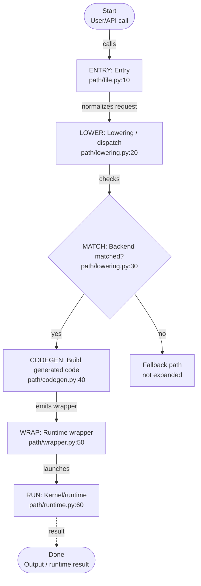
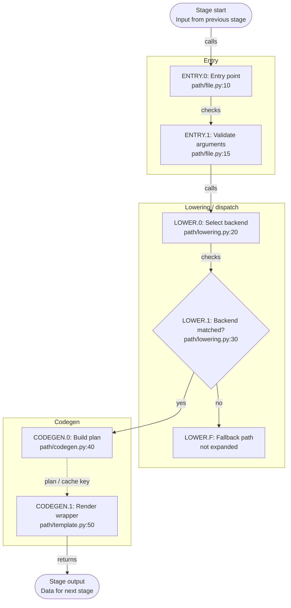

# Feature Code Tour Workflow Reference

## Discovery Commands

Use these commands as a starting point, adjusting commit ranges and symbols to the repo:

```bash
git branch --show-current
git remote -v
git log --oneline --decorate -n 20
git diff --name-status <base>...HEAD
git diff --stat <base>...HEAD
git show --name-only --oneline <commit>
rg -n "symbol_or_backend_name" .
rg --files | rg "tour|mermaid|feature|test"
```

When comparing feature commits, collect:

- Entry files: examples, tests, public APIs.
- Dispatch/lowering files.
- Matcher or selector files.
- Codegen/template files.
- Runtime wrapper files.
- Kernel/runtime files.
- Validation scripts and reports.

## Output Naming

Prefer lowercase snake-case-ish filenames under `.tour/`:

```text
.tour/<feature>_main_flow_mermaid.md
.tour/<feature>_main_flow_mermaid.html
.tour/<feature>_<stage>_flow_mermaid.md
.tour/<feature>_<stage>_flow_mermaid.html
.tour/<feature>_execution_hierarchy.tour
.tour/<feature>_execution_narrative_mermaid.md
.tour/<feature>_execution_narrative_mermaid.html
.tour/<feature>_current_implementation_report_YYYYMMDD.md
.tour/<feature>_python_to_kernel_trace_report_YYYYMMDD.md
```

Create the main flow before stage subflows. The main file should answer "what are the phases?"
The stage files should answer "what code runs inside this phase?"

## CodeTour JSON Shape

Use the VS Code CodeTour extension style:

```json
{
  "title": "Feature Execution Hierarchy",
  "description": "End-to-end walkthrough of the feature implementation path.",
  "steps": [
    {
      "file": "relative/path/from/repo/root.py",
      "line": 123,
      "description": "Explain what happens at this step."
    }
  ]
}
```

Keep steps ordered by actual execution flow, not by file order.

## Main Mermaid Structure Template



## Stage Mermaid Structure Template



## HTML Export

After writing or updating Mermaid Markdown files, export matching HTML files:

```bash
python3 .agents/skills/feature-code-tour/scripts/export_mermaid_html.py .tour
```

The exporter accepts either a directory or a single Markdown file. For each `*_mermaid.md`,
it writes a same-basename `.html` file that embeds Mermaid.js and keeps clickable links.

## Mermaid Compatibility Checklist

Run this mental checklist before finishing:

- Mermaid fences are balanced.
- Every `subgraph` has a matching `end`.
- Branch nodes use `{...}` and all outgoing branch edges have labels.
- Fallback branches terminate in explicit nodes if not expanded.
- No `-.->|label|` dashed edge syntax.
- No node id named exactly `END`.
- No label starts with `1. text` or another Markdown ordered-list pattern.
- No accidental HTML entity noise such as `&#46;`.
- `doc_id(q)` style labels are safer than `doc_id[q]` for stricter renderers.
- Click targets use absolute paths and line numbers.
- Every `*_mermaid.md` has a same-basename `.html` export.

## Git Hygiene

When committing:

```bash
git status --short
git add .tour/<specific-file-1> .tour/<specific-file-2>
git diff --cached --stat
git commit -m "docs: add <feature> code tour"
git push origin <branch>
git push gitcode <branch>
```

Do not stage unrelated generated files such as `.DS_Store`, old reports, or unrelated plan files.
