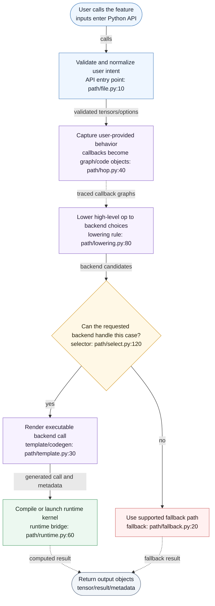
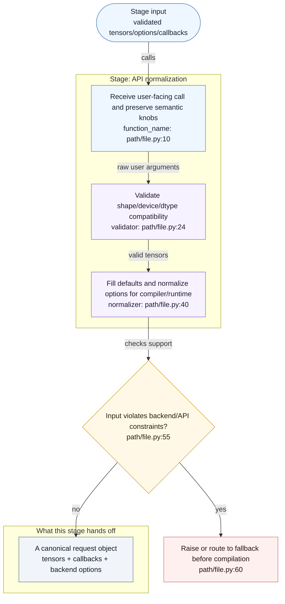

# Feature Code Tour Workflow Reference

## Discovery Commands

Use these commands as a starting point, adjusting commit ranges and symbols to the repo:

```bash
git branch --show-current
git remote -v
git log --oneline --decorate -n 20
git diff --name-status <base>...HEAD
git diff --stat <base>...HEAD
git show --name-only --oneline <commit>
rg -n "symbol_or_backend_name" .
rg --files | rg "tour|mermaid|feature|test"
```

When comparing feature commits, collect:

- Entry files: examples, tests, public APIs.
- Dispatch/lowering files.
- Matcher or selector files.
- Codegen/template files.
- Runtime wrapper files.
- Kernel/runtime files.
- Validation scripts and reports.

For every stage, capture what it consumes, what it changes, what it emits, and which source lines prove that behavior.

## Output Naming

Emit exactly one Mermaid Markdown file, one same-basename HTML file, and one CodeTour JSON file unless the user explicitly asks for extra reports. Use the generator/model/date prefix:

```text
.tour/codex-gpt5.5-YYYYMMDD-<feature>_mermaid.md
.tour/codex-gpt5.5-YYYYMMDD-<feature>_mermaid.html
.tour/codex-gpt5.5-YYYYMMDD-<feature>_codetour.tour
```

Keep `<feature>` short and readable, for example `flexattention-cutlass-fai`. Replace `YYYYMMDD` with the actual generation date.

The Mermaid file should contain multiple Mermaid fenced blocks in this order:

1. Main flowchart: answers "what are the phases?"
2. Stage subflowcharts: answer "what happens inside each phase?"

Do not create separate code-level Mermaid files. Every Mermaid node should explain behavior first and code location second.

## CodeTour JSON Shape

Use the VS Code CodeTour extension style:

```json
{
  "title": "Feature Execution Hierarchy",
  "description": "End-to-end walkthrough of the feature implementation path.",
  "steps": [
    {
      "file": "relative/path/from/repo/root.py",
      "line": 123,
      "description": "Explain what this code does in the feature path."
    }
  ]
}
```

Keep steps ordered by actual execution flow, not by file order.

## Mermaid File Skeleton

````markdown
# <Feature> Execution Path

Generated by: codex-gpt5.5
Generated at: YYYY-MM-DD
Scope: <commit range, branch, or local working tree assumption>

## Main Flow


## Stage 1: <Stage Name>


````

## Main Flow Template



## Stage Subflow Template



## Writing Style For Mermaid Nodes

Good node labels:

```text
Trace score_mod into a reusable graph<br/>trace_flex_attention: torch/_higher_order_ops/flex_attention.py:406
```

```text
Package block-sparse metadata for the backend<br/>BlockSparseTensors: templates/flash_attention.py.jinja:44
```

Avoid node labels that only name code:

```text
trace_flex_attention<br/>torch/_higher_order_ops/flex_attention.py:406
```

Each stage should mention:

- Input: what object/data/control reaches this stage.
- Transformation: what the stage changes, validates, traces, lowers, renders, compiles, or launches.
- Output: what object/data/control goes to the next stage.
- Failure path: what happens when the backend, dtype, shape, mask, or compile path is unsupported.

## HTML Export

After writing or updating the Mermaid Markdown file, export its matching HTML file:

```bash
python3 .agents/skills/feature-code-tour/scripts/export_mermaid_html.py .tour
```

The exporter accepts either a directory or a single Markdown file. For the one `*_mermaid.md`, it writes a same-basename `.html` file that embeds Mermaid.js, keeps clickable links, and uses a restrained theme inspired by the clear spacing and themeability of `beautiful-mermaid`.

## Mermaid Compatibility Checklist

Run this mental checklist before finishing:

- Mermaid fences are balanced.
- Every `subgraph` has a matching `end`.
- Branch nodes use `{...}` and all outgoing branch edges have labels.
- Fallback branches terminate in explicit nodes if not expanded.
- No `-.->|label|` dashed edge syntax.
- No node id named exactly `END`.
- No label starts with `1. text` or another Markdown ordered-list pattern.
- No accidental HTML entity noise such as `&#46;`.
- `doc_id(q)` style labels are safer than `doc_id[q]` in Mermaid labels.
- Click targets use absolute paths and line numbers.
- There is exactly one `*_mermaid.md` file for the feature request.
- That Mermaid Markdown file has a same-basename `.html` export.
- Mermaid nodes explain behavior first and code locations second.

## Git Hygiene

When committing:

```bash
git status --short
git add .tour/codex-gpt5.5-YYYYMMDD-<feature>_mermaid.md .tour/codex-gpt5.5-YYYYMMDD-<feature>_mermaid.html .tour/codex-gpt5.5-YYYYMMDD-<feature>_codetour.tour
git diff --cached --stat
git commit -m "docs: add <feature> code tour"
git push origin <branch>
```

Do not stage unrelated generated files such as `.DS_Store`, old reports, or unrelated plan files.
