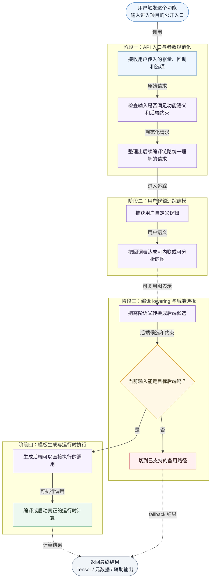
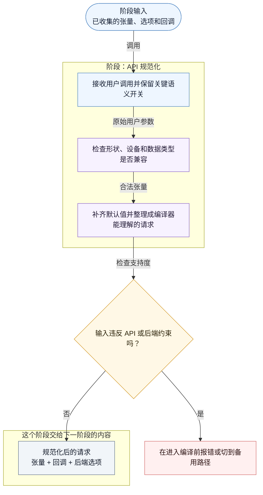

# Feature Code Tour Workflow Reference

## Discovery Commands

Use these commands as a starting point, adjusting commit ranges and symbols to the repo:

```bash
git branch --show-current
git remote -v
git log --oneline --decorate -n 20
git diff --name-status <base>...HEAD
git diff --stat <base>...HEAD
git show --name-only --oneline <commit>
rg -n "symbol_or_backend_name" .
rg --files | rg "tour|mermaid|feature|test"
```

When comparing feature commits, collect:

- Entry files: examples, tests, public APIs.
- Dispatch/lowering files.
- Matcher or selector files.
- Codegen/template files.
- Runtime wrapper files.
- Kernel/runtime files.
- Executor internals: loops, partitioning, buffers, queues, caches, callback/handler construction, async/event synchronization, staged pipelines, worker coordination, and output commits.
- Validation scripts and reports.

For every stage, capture what it consumes, what it changes, what it emits, and which source lines prove that behavior.

For generated, multi-language, framework-driven, or staged systems, always split the analysis across every producer/consumer boundary:

- Producer side: user intent capture, parsing/tracing/config interpretation, intermediate model or graph construction, transformation passes, lowering, artifact rendering, generated arguments, and generated files or metadata.
- Consumer side: parameter conversion, resource planning, launch path, scheduler or runtime selection, worker/kernel/runtime execution, loops, state/buffer/cache management, callbacks/handlers, synchronization, staged phases, and final output.

Do not stop at generated files, examples, wrappers, or entry-point code until you have checked whether an upstream producer or downstream executor also participates.

## Style Reference

When available, read `/Users/zhangwh/Documents/ObsidianBlogs/ZWHNotes/技术博客/FlexAttention相关/【WIP】FlexAttention接入Cutlass链路分析.md` before writing the report. Use it only as a style reference for:

- 先写整体调用链路和背景说明。
- 再用一个带 `subgraph` 的主流程图串起阶段。
- 后面按章节展开每个阶段。
- 每个阶段先给子流程图，再写中文执行流程分析。

Do not copy its older pattern of putting code paths inside node labels. Generated node labels must stay code-free and Chinese.

## Output Naming

Emit exactly one Mermaid Markdown file and one CodeTour JSON file under the target project's root `.tour/` directory unless the user explicitly asks for extra reports or another artifact. Resolve the root with `git rev-parse --show-toplevel` when available; otherwise use the current working directory.

Use a filename that displays the tool, model, analyzed feature, and generation date:

```text
.tour/<tool>-<model>-<feature>-YYYYMMDD_mermaid.md
.tour/<tool>-<model>-<feature>-YYYYMMDD_codetour.tour
```

Choose `<tool>` and `<model>` from the actual user context. Prefer explicit user-provided values; otherwise use the current tool/app identity and model identity when known. Keep all filename parts lowercase and filesystem-safe. Keep `<feature>` short and readable, for example `flexattention-cutlass-fai`. Replace `YYYYMMDD` with the actual generation date.

The Mermaid file should follow the same rhythm as a technical blog analysis: a main overview first, then one chapter per stage. It should contain multiple Mermaid fenced blocks in this order:

1. `## 整体调用链路`: main flowchart with `subgraph` blocks for stages, answering "what are the phases and how do they connect?"
2. `## 阶段 N：...`: detailed stage subflowcharts, answering "what happens inside this phase?"
3. `### 执行流程分析`: Chinese prose immediately after each stage subflowchart, explaining input, decision points, transformation, output, and next handoff.

Do not create separate code-level Mermaid files. Every Mermaid node label should contain Chinese natural-language behavior only. Keep function names, file paths, and line numbers out of node labels; put source locations only in Mermaid `click` statements and CodeTour JSON.

## CodeTour JSON Shape

Use the VS Code CodeTour extension style:

```json
{
  "title": "Feature Execution Hierarchy",
  "description": "End-to-end walkthrough of the feature implementation path.",
  "steps": [
    {
      "file": "relative/path/from/repo/root.py",
      "line": 123,
      "description": "用中文说明这行代码在功能链路里承担的作用。"
    }
  ]
}
```

Keep steps ordered by actual execution flow, not by file order.

## Mermaid File Skeleton

````markdown
# <Feature> Execution Path

工具：<tool>
模型：<model>
分析功能：<feature>
生成日期：YYYY-MM-DD
分析范围：<commit range, branch, or local working tree assumption>

## 整体调用链路

先用中文概括这个功能链路：用户入口是什么，前端语义由谁处理，编译或调度层做什么，后端或运行时负责什么，最终产物是什么。


## 阶段 1：<Stage Name>


### 执行流程分析

用中文说明这个阶段的输入、关键判断、转换动作、输出对象，以及它如何交给下一阶段。
````

## Main Flow Template



## Stage Subflow Template



## Writing Style For Mermaid Nodes

Good node labels use Chinese natural-language descriptions only:

```text
把用户的分数修改逻辑追踪成后端可内联的图
```

```text
把块稀疏索引整理成后端需要的元数据
```

Avoid node labels that contain code identifiers or source locations:

```text
trace_flex_attention<br/>torch/_higher_order_ops/flex_attention.py:406
```

Each stage should mention in Chinese:

- 输入：什么对象、数据或控制流进入这个阶段。
- 转换：这个阶段做了哪些校验、追踪、lowering、渲染、编译或启动动作。
- 输出：什么对象、数据或控制流交给下一阶段。
- 失败路径：后端、dtype、shape、mask 或编译路径不支持时会怎么处理。

## Stage Analysis Template

After every detailed stage subflowchart, write:

```markdown
### 执行流程分析

这个阶段从上一阶段接收……，首先……，然后……。如果……，会走……；否则会继续……。阶段结束时会产出……，并把它交给下一阶段的……使用。
```

Keep this analysis grounded in the source lines discovered earlier. Mention code locations in prose only when useful; the Mermaid visual nodes should stay code-free.

## Mermaid Compatibility Checklist

Run this mental checklist before finishing:

- Mermaid fences are balanced.
- The main flowchart uses `subgraph` blocks to group stages, and every `subgraph` has a matching `end`.
- Branch nodes use `{...}` and all outgoing branch edges have labels.
- Fallback branches terminate in explicit nodes if not expanded.
- No `-.->|label|` dashed edge syntax.
- No node id named exactly `END`.
- No label starts with `1. text` or another Markdown ordered-list pattern.
- No accidental HTML entity noise such as `&#46;`.
- `doc_id(q)` style labels are safer than `doc_id[q]` in Mermaid labels.
- Click targets use absolute paths and line numbers.
- There is exactly one `*_mermaid.md` file for the feature request.
- Mermaid node labels use Chinese natural language only and do not contain function names, file paths, or line numbers.
- Every detailed stage section includes `### 执行流程分析` prose after its Mermaid block.

## Git Hygiene

When committing:

```bash
git status --short
git add .tour/<tool>-<model>-<feature>-YYYYMMDD_mermaid.md .tour/<tool>-<model>-<feature>-YYYYMMDD_codetour.tour
git diff --cached --stat
git commit -m "docs: add <feature> code tour"
git push origin <branch>
```

Do not stage unrelated generated files such as `.DS_Store`, old reports, or unrelated plan files.
